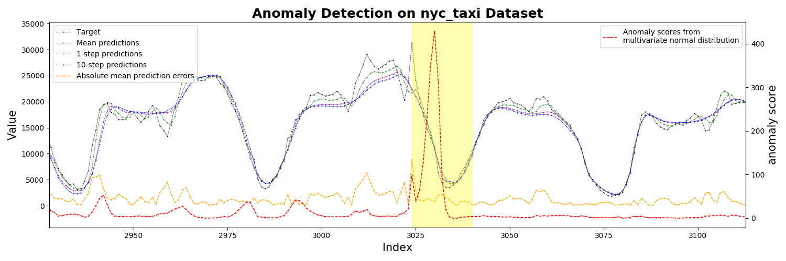
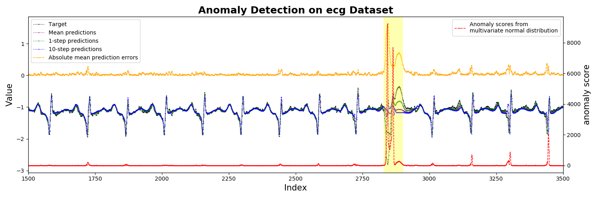
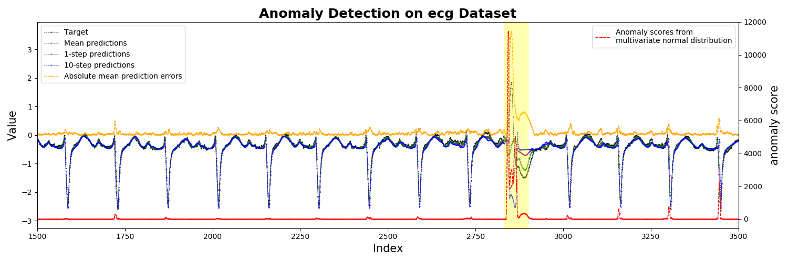
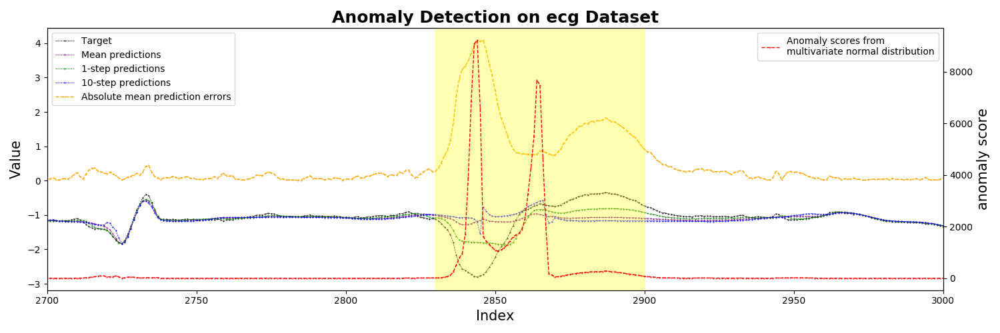
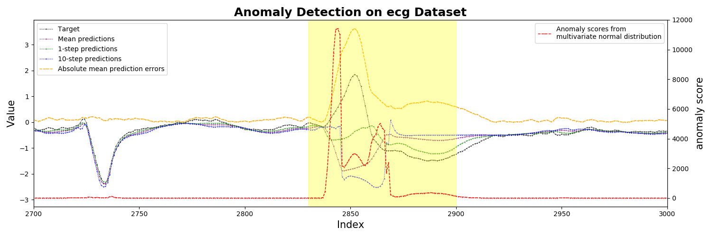

# RNN-Time-series-Anomaly-Detection
RNN based Time-series Anomaly detector model implemented in Pytorch.

This is an implementation of RNN based time-series anomaly detector, which consists of two-stage strategy of time-series prediction and anomaly score calculation.


## Requirements
* Python 3.5+
* Pytorch 0.3.1+
* Numpy
* Matplotlib

## Dataset
__NYC taxi passenger count__
 * The New York City taxi passenger data stream, provided by the [New
York City Transportation Authority](http://www.nyc.gov/html/tlc/html/about/trip_record_data.shtml )
 * preprocessed (aggregated at 30 min intervals) by Cui, Yuwei, et al. in ["A comparative study of HTM and other neural network models for online sequence learning with streaming data." Neural Networks (IJCNN), 2016 International Joint Conference on. IEEE, 2016.](http://ieeexplore.ieee.org/abstract/document/7727380/)
  , [code](https://github.com/numenta/htmresearch/tree/master/projects/sequence_prediction)

__Electrocardiograms (ECGs)__
 * The ECG dataset containing a single anomaly corresponding to a pre-ventricular contraction, provided by E. Keogh et al. in
["HOT SAX: Efficiently Finding the Most Unusual Time Series Subsequence." In The Fifth IEEE International Conference on Data Mining. (2005)
](http://ieeexplore.ieee.org/abstract/document/1565683/)
  , [dataset](http://www.cs.ucr.edu/~eamonn/discords/)

__2D gesture__
 * X Y coordinate of hand gesture in a video, provided by E. Keogh et al. in
["HOT SAX: Efficiently Finding the Most Unusual Time Series Subsequence." In The Fifth IEEE International Conference on Data Mining. (2005)
](http://ieeexplore.ieee.org/abstract/document/1565683/)
  , [dataset](http://www.cs.ucr.edu/~eamonn/discords/)

## Implemented Algorithms
* RNN based Multi-step predictor
  - [Malhotra, Pankaj, et al. "Long short term memory networks for anomaly detection in time series." Proceedings. Presses universitaires de Louvain, 2015.](https://www.elen.ucl.ac.be/Proceedings/esann/esannpdf/es2015-56.pdf)


* Multivariate Gaussian distribution based anomaly detector
  - [Malhotra, Pankaj, et al. "LSTM-based encoder-decoder for multi-sensor anomaly detection." arXiv preprint arXiv:1607.00148 (2016).](https://arxiv.org/pdf/1607.00148.pdf)

* Anomaly score predictor
  - [Park, Daehyung, Yuuna Hoshi, and Charles C. Kemp. "A Multimodal Anomaly Detector for Robot-Assisted Feeding Using an LSTM-based Variational Autoencoder." IEEE Robotics and Automation Letters 3.3 (2018): 1544-1551.](https://arxiv.org/pdf/1711.00614.pdf)


## Example of usage
__1. Time-series prediction:__
Train and save RNN based time-series prediction model
```
    python 1_train_predictor_ecg.py
    python 1_train_predictor_nyc.py
```
__2. Anomaly detection:__
Fit multivariate gaussian distribution on train dataset and
calculate anomaly scores on test dataset
```
    python 2_anomaly_detection_ecg.py
    python 2_anomaly_detection_nyc.py
```
## Result
__1. Time-series prediction:__
Predictions from the stacked RNN model


__2. Anomaly detection:__

Anomaly scores from the Multivariate Gaussian Distribution model


* NYC taxi passenger count




* Electrocardiograms (ECGs)










## To do
* Add more time-series data
* Add quantitative evaluation method such as precision, recall and F1 score.


